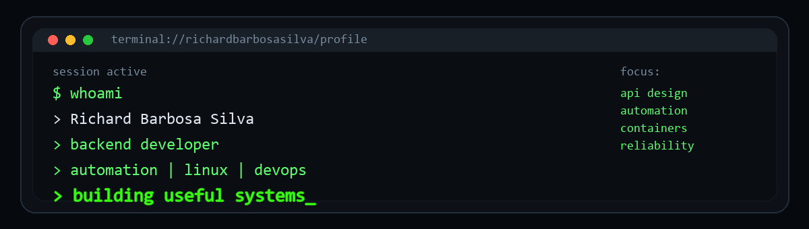

<div align="center">



## Backend Developer turning operational problems into practical systems

<p>
  <a href="#-about"></a>
  <a href="#-tech-radar"></a>
  <a href="#-stats-panel"></a>
  <a href="#-commit-signal"></a>
  <a href="#-contact"></a>
</p>

<p>
  
  
  
  
  
  
</p>

</div>

---

## / tech-radar

<div align="center">

### Backend and APIs


### Infra and DevOps


### Data and Tools


</div>

<table>
  <tr>
    <td valign="top" width="33%">
      <h3>Backend</h3>
      APIs REST, regras de negocio, integracoes, validacao, organizacao de servicos e arquitetura orientada a clareza.
    </td>
    <td valign="top" width="33%">
      <h3>Automation</h3>
      Scripts, rotinas operacionais, jobs, pipelines e eliminacao de trabalho manual recorrente.
    </td>
    <td valign="top" width="33%">
      <h3>Infrastructure</h3>
      Containers, reverse proxy, Linux, self-hosted apps, deploy e confiabilidade de ambiente.
    </td>
  </tr>
</table>

---

## / stats-panel

<div align="center">
  
  
</div>

<div align="center">
  
  
</div>

---

## / commit-signal

<div align="center">
  
</div>

<div align="center">
  
</div>

---

## / operating-mode

<table>
  <tr>
    <td valign="top" width="50%">

### What you'll find here

- Backend services and REST APIs
- Automation for technical and operational routines
- Self-hosted tooling experiments
- Infrastructure and container-based setups
- Deploy, observability and reliability studies
- Projects focused on productivity and scale

   </td>
   <td valign="top" width="50%">

### Core principles

- Prefer practical solutions over unnecessary complexity
- Automate whatever becomes repetitive
- Keep services simple to maintain
- Treat infrastructure as part of the product
- Build with reliability and readability in mind
- Keep evolving one layer at a time

   </td>
  </tr>
</table>

---

## / deep-dive

<details>
  <summary><strong>More about my technical interests</strong></summary>
  <br />

- Service architecture and clean backend organization
- Linux-based workflows and server administration
- Containers, self-hosted services and deployment routines
- Operational automation and scripting
- Monitoring, observability and reliability improvements
- Practical solutions for real-world technical bottlenecks

</details>

<details>
  <summary><strong>Current focus</strong></summary>
  <br />

```yaml
current_focus:
  - backend_development
  - python_ecosystem
  - api_design
  - linux_and_containers
  - automation_and_devops_workflows
  - practical_scalable_systems
```

</details>

---

## / contact

<div align="center">

<a href="https://www.linkedin.com/in/richard-barbosa-silva-862897255">
  
</a>
<a href="https://github.com/Richardbarbosasilva">
  
</a>

<br />
<br />

<sub>Build practical systems. Automate the boring parts. Keep evolving.</sub>

</div>
